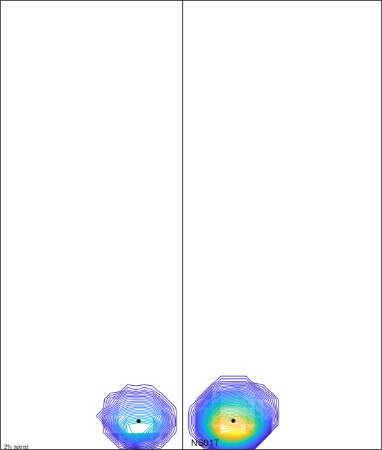
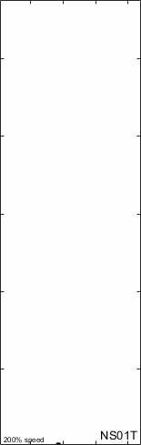

# Impressions

Impressions analyzes raw plantar pressure data to measure various aspects of walking. It can generate a plantar pressure report, videos of applied pressure over time (GIFs), and data for research projects within minutes of data collection. 

Impressions uses specific file types of pressure data, basic subject parameters (age, height, mass, and foot length), and various processing selections to automate most processing steps. Impressions is completely coded in Matlab (requiring version 2017b+ and the image processing toolbox), and thus can be customized as desired. Impressions functions best when a person walks at a constant pace over the mat without any assistance.

### Updates in v1.3:
- Normalization of pressures relative to mask orientation, foot length, and foot width
- Processing data now saved as XXX_Results.mat
- Basic static trial analysis option to obtain foot length
- Medial-lateral and anterior-posterior center of pressure index metrics now operational

### Primary Outcome Variables:
- Center of Pressure (CoP)
- Foot Progression Angles
- Force and Pressure Distribution Across the Foot
- Temporal-spatial parameters of gait (walking speed, cadence, step length, step width, etc)

### Inputs:
- Time-Series Matrix of raw pressure data (aka Entire Plate Roll Off)
- This data file should contain a 2-D (length by width) matrix of pressure or force variables arranged in a consecutive time series (duration of the trial). A quality recording will contain 2-5 steps along the length of the mat.
- PPSelector_File.xlsx
- Subject demographics and processing settings

### Outputs:
- Plantar Pressure Report: spreadsheet containing the most relevant figures, metrics, and ratios from analysis
- Various Figures: PNG files of the force distributions and close up still images (pg 3&4 of report)
- Saved XXX_Results.mat file: This file contains all the saved data from the matlab workspace so that the data may be saved in an analysis-friendly version for future reference. Most data are stored in the “DynamicPPTrials” or “Regions” structures.
- GIF movie files for each: If selected, these GIFs show the dynamic pressure distribution and CoP progression. The black dot shows the CoP for the current frame, while the red dots show the COP from the preceding 3 frames so that CoP velocity may be better interpreted.

### Supported PP Mats and file types
Upon initial release, Impressions only functions with data from a RS Scan 2m or Novel emedXL mat. These files can initially be loaded as raw files directly from RS Scan or Novel or as pre-processed .mat files (recommended file after first time loading the raw files).

## Procedures
### Export Raw Plantar Pressure Data
From Novel:

To export raw ‘.lst’ files from Novel, first select all full trials you would like to export (typically .dat files), then select run application and choose emascii. From there you will need to select the output parameters. Select “sensor grid”, “frame header”, “values of pressure”, “frames”, and ensure it is tab delimited. Click ok, and then choose File -> save all, then all trials will be saved in the C:\novel\novfile\asciiout folder. Copy these raw ‘.lst’ files into the impressions matlab folder.

From RSScan:

To export raw RSScan data, one must select each trial individually within footscan, click export, and select entire plate roll off. Then save this generic file in your desired location. See figure above.

### Select Input Parameters and Processing Type
Prior to running Impressions and processing any data, it is important that the user inputs the subject demographics and selects processing methods for quality data processing (see example to the lower right). Open PP_Selector_File.xlsx excel sheet and input subject demographics into the top section. Foot length is optional but suggested if you will compare to optical motion capture data. A study number is necessary because the will be the name of the folder where all exports are saved.

Next, choose your processing methods by selecting from each dropdown list in the Processing Inputs section. Lastly, determine which figures you would like to have shown at the end of processing. Note: if you opt to export a report, then temporal spatial, close up, and all forces figures along with the first 4 trials will always be exported as they are necessary for the report.

If you would only like to export GIFs (for a Full Gait Analysis), select “No” for Export Report. This will accelerate the processing time by not applying masks or computing temporal spatial variables.

### Loading
Impressions uses the plantar_load.m function to load raw text files. These can be loaded up to 10 at a time and all can be saved to a matlab data file (.mat) for quicker loading in the future. Raw files typically take 10-60 seconds depending on the duration of the sampling. For processing, copy all raw data or .mat files into the Impressions folder so that they may be loaded correctly.

### Identifying Pressures
Impressions identifies foot pressures by using specific functions of Matlab’s image processing toolbox [BWConnComp](https://www.mathworks.com/help/images/ref/bwconncomp.html) & [RegionProps](https://www.mathworks.com/help/images/ref/regionprops.html). These functions identify all pressure regions within the summed pressure plate image (a sum of all frames for the duration of the trial). Then Impressions joins together all regions that are within the defined foot length of each other as the foot region.

### Left/Right Classification
These pressures are identified within a red or green box (for left and right feet respectively). Left and right feet are classified in separate ways depending on how many full steps are on the mat. If there are 1 or 3+ full steps on the mat, a linear trendline of the CoP is created and steps are split into left/right by the trendline. If two full steps are on the mat, then the two centroids of those two steps are averaged and this location is used to split the pressures into left and right sides.
### Temporal Spatial Parameters
The temporal spatial parameters are measured by identifying the first and last instances of applied pressures within the defined foot area. Two consecutive valid steps are required for measurements of gait speed, cadence, stride length, and step width. Three consecutive valid steps are required for stance phase, swing phase, initial double support (1DS), single limb support (SLS), and secondary/final double support (2DS). Temporal spatial parameters are shown as averages of eligible measures from all trials.
### Foot Progression Angles
Foot progression angles are determined entirely from the mask. For more masking info, see next page. Foot progression angles can also be defined manually, by clicking behind the center of the heel and towards the 2nd toe as shown in the image to the right. This will automatically be prompted depending on your processing selections.
## Mask Definitions

### Manual
The manual masking method requires user input to identify the base of the heel and 2nd toe. Once these are input into Impressions by clicking for each pressure, a line through those two points identifies the foot progression angle.

### General
The general mask uses specific functions in Matlab’s image processing toolbox (see above) to assign a centroid and major axis to each identified step. The major axis angle is projected through the centroid of the entire foot pressure.

### Heel-Centroid (top right)
The heel-centroid method uses the peak heel region location and the whole foot centroid, and generates a line along the length of the foot that bisects these two points (black circles).

### CoP (middle right)
The center of pressure (CoP) masking method uses the entire center of pressure progression for each step. A linear trendline is generated from all CoP points during stance.

### 66% CoP (bottom right)
The 66% CoP masking method uses only the first 66% of the CoP to generate its linear trendline. The rationale behind this idea, is that in typical walkers during late stance, the CoP progressed medially as the large toe is used during push off.

### CoP Inter-Peak (next page)
Peaks are measured along the global reference frame, thus if the participant is not walking along the length of the mat, or has excessively external foot progression angles (> 45 deg), this method may not be accurate. The first two major peaks along the length of the mat correspond to the heel and forefoot peak pressure regions (the third corresponds to the large toe). The CoP progression between the heel and forefoot peaks is extracted and used to create a linear regression for the inter-peak method.

## Overall Masking Methods
Once the foot progression angle is identified, the process of masking is the same for all mask types. These masks split the foot pressure into six regions (medial/lateral divisions of heel, arch, and forefoot). The line of foot progression bisects the foot into medial and lateral regions. Impressions will search along the length of the foot progression line to find the edge of the foot region which defines the heel base and toe top of the mask (red circles). This length is split into 30% heel, 30% arch, 40% forefoot regions and HA = heel-arch and FA = fore-arch points are located (purple circles). Impressions also searches medially and laterally in lines parallel to the foot progression line to identify the medial and lateral borders of the pressure. Lines perpendicular to the foot progression angle bisect the HA/FAs to split the pressure longitudinally.

### Mask Normalization
After the masks are created, each step is normalized by re-orienting the mask using its foot progression angle. It is rotated by the mask orientation to display each step upright. Once the orientation is normalized, then the dimensions of each step is normalized to 100% of its length and width, and finally normalized to 100% of the stance period. This results in a 100x100x100 matrix displaying dynamic foot pressures by the respective length, width, and duration of each step. All this data can be found in the “Norm” variable within the results .mat file for each participant.

Once each step is normalized, it allows us to combine all the steps for each participant and compare it to typical walkers. This is displayed in the figure below, showing the average and normalized summed step, and each center of pressure trajectory for all steps compared to a set of typical walkers. The default typical walkers are a set of 20 individuals collected in summer 2018 at CGMA.

## Center of Pressure Index (Medial-Lateral and Anterior-Posterior)
Once step normalization is complete, we can now compare all steps to a typical population to quantify deviation. A graphic of this is shown above with the center of pressure trajectories, and compared to the norm (black line = average, dashed line = standard deviation). However this can also be quantified by a center of pressure index. There are many different definitions of CoP index, this adaptation is borrowed from Shriner’s Hospital Spokane, where the deviation between the average CoP and a group norm is quantified by the medial and lateral deviation (in % of foot length/width) at each interval (1-100%) of stance phase. Then the root mean square of this deviation is calculated to obtain a single value (for AP and ML of the left and right feet).

### Pressures, Forces, and Areas
After each valid step and mask are identified by Impressions, a mask for each of the 6 regions is defined for every valid step in each trial. The pressures, forces, and areas over the duration of the trial are summed, averaged, and/or maximums are defined and can be plotted via:
- Plot All Forces - plots forces for each of the 6 regions for all valid steps as % of gait cycle and relative to the walker’s body mass, as shown on page 4 of the report
- Plot Average Forces – plots the average ± standard deviation for each of the 6 regions for all valid steps as % of gait cycle and relative to the walker’s body mass, as shown on page 4 of the report.
- Plot Validation – plots peak pressure, force, and area of the full trial, similar to novel’s head’s up display. See Validation -> Impressions vs novel below for more info

## Report
Impressions will export an automated report for quick overview and display of gait measures. This 4-page report is exported into an excel spreadsheet which can then be printed for clinician or patient.

### Page 1 (top left)
The first page of the report displays the subject demographics, general processing settings, foot progression angles, and the first 4 PP trials. Only the first 4 are shown because displaying more shrinks the size of each trial. The foot progression angle chart will show the values of the first 2 steps on each side, up to 10 trials. The average and standard deviation of these angles are shown on the right.

### Page 2 (top right)
The second page of the report is entirely devoted to the temporal-spatial parameters. The top chart displays the general gait performance metrics as an average of all valid trails. This is shown in standard units and as a % of the age-matched norm. The second chart displays step timing characteristics of stance, swing, and single/double support phases. These measures can only be computed if there are 3 or more valid steps on the mat, thus this section will be blank if no trials meet this case.
The bottom half of page 2 displays a graphical version of the temporal spatial parameters (similar to WAAAG). The top and bottom rows of this figure correspond to the charts above (gait performance on top and step timing below). *Note: temporal-spatial parameters do not have sidedness in this report because generally there are not enough steps recorded to classify sidedness.

### Page 3 (bottom left)
Page 3 displays the pressure distribution ratios, center of pressure metrics, and a close-up of two steps from a single trial. The charts display the measures for the chosen steps (displayed below) and the average and standard deviation for all valid steps from all trials. Definitions of each metric can be found on the right-hand side of the table. The close-up pressures display a higher quality image of the selected pressures as well as the center of pressure during stance phase. These close-ups are summed over the entire stance phase, thus display all force/pressure distributions over each full step.

### Page 4 (bottom right)
In addition to the normalized average steps and centers of pressure described above, the final page of the report shows the force distribution as a % of body weight over the stance phase for each foot and within each region of the 6-part mask. Left and right steps are shown on the left and right sides. The top plots display the distributed forces within each of the 6 regions (medial/lateral forefoot/arch/heel). The bottom plots show the overall heel/arch/forefoot and total (black) forces. The colored bars at the top of these bottom plots show where the CoP is typically located (heel/arch/forefoot) as a percentage of stance phase (Jameson et al. Dynamic Pedobarography for Children, Use of the Center of Pressure Progression. J Pediatr Orthop 2008;28:254Y258).
*The force distributions have yet to be validated against the force platforms. Reliability seems lower for RSScan data.

## Validation
Impressions has been validated against two separate sources: optical motion capture and the novel processing software. These data are only for PP data collected with Novel emed XL.

### Impressions vs Optical Motion Capture (OMC)
#### Masking Accuracy: Orientation and Position
Mask accuracy was validated by comparing the mask orientation (via foot progression angle) and position (mask placement in the global coordinate system).
Accuracy for each of the 5 masking types are shown to the right. FPA errors for each masking method compared to optical motion capture. The median, interquartile range, and outliers are shown in red. The mean and SD are shown in black. *** = p < 0.001, * = p < 0.05.

#### Temporal Spatial Parameters
The accuracy of temporal spatial parameters of gait was assessed between PP mat and OMC.
Kruskal-Wallis tests of cadence, walking speed, step length, and step width. Means for cadence, walking speed, and step length were found to have indistinguishable differences in measurements, while step width had a distinguishable difference in measurements. The difference in step width may be due to masking inaccuracy because the heel point is used for these calculations. We will be re-processing the temporal spatial comparisons with updated masking.

#### Impressions vs Novel
Below is an example of the validation of pressure distribution, forces applied, and area in contact with the PP mat.
